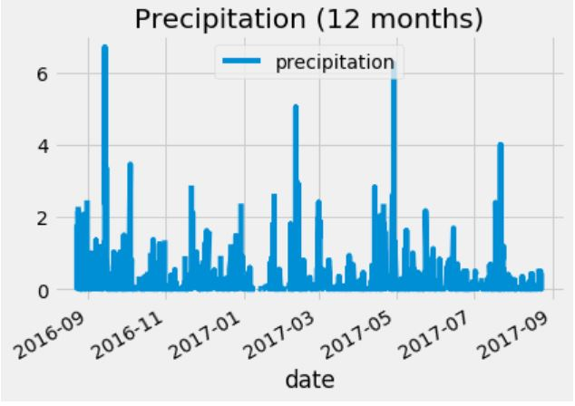

# Advanced SQL

Developed a climate analysis API
- Data Engineering
- Database Engineering
- Climate Analysis and Exploration
  - Precipitation
  
  
  
  - Station
  
  
  
  - Temperture
  
  
 
- Climate App

Languages and Tools:
- Python
- Pandas
- SQLAlchemy
- SQLite
- ORM Queries
- Flask
- Matplotlib
- JSON
